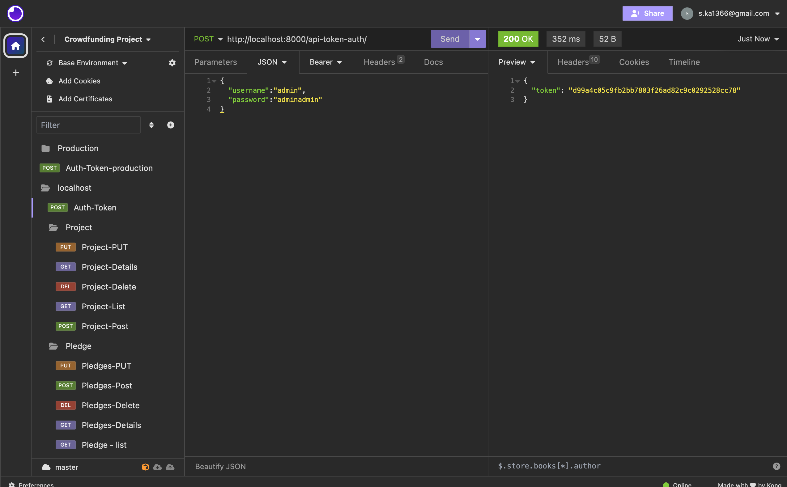

# crowdfunding_back_end
FitFlare By Sahar

## Planning:
### Concept/Name

This health and fitness crowdfunding site allows people to ask for sponsership for a variety of innovations, spanning wearable devices, smart fitness equipment, nutritional supplements, wellness apps, and more. This project aim to enhance well-being, physical activity, and overall health. Common elements include wearable devices, smart fitness equipment, Nutritional Supplement, Health Apps and Software, Health Monitoring Devices, Personalized Health Services, education programs and workshops, Community Wellness Projects and etc.

### Intended Audience/User Stories

The intended audience for this health and fitness-related crowdfunding site may vary based on the specific product or project. However, in general, the target audience typically includes individuals who have an interest in maintaining a healthy lifestyle, improving their fitness, and exploring innovative health and wellness solutions. 
Some example of the primary target audiences for this project :​

Health and Fitness Enthusiasts: who are eager on maintaining a healthy lifestyle.​
Technology Enthusiasts: Those interested in the latest health tech innovations.​
Wellness Consumers: People prioritizing overall well-being.​
Health Professionals: Healthcare, fitness, and nutrition experts seeking new tools.​
Outdoor Enthusiasts: Those interested in outdoor fitness and adventure.​
Mental Health Advocates: Individuals concerned about mental well-being.​
Cooking and Nutrition Enthusiasts: Passionate about healthy eating and kitchen innovations.​
Fitness Gamers and VR Fans: Gamers and tech enthusiasts interested in interactive fitness experiences.

### Front End Pages/Functionality
Home page:
- Navigation bar
- Login form
- Categories to help users navigate.
- Overview of featured and popular projects.

Project Listing Page:
- Displays a grid or list of projects.
- Project cards with images, titles, brief descriptions, and funding progress.

Project Details Page:
- In-depth information about a specific project.
- Project description, goals, and timeline.
- Funding progress bar.
- Options to share on social media.
- List of supporters and their contributions.

User Registration and Login:
- Registration and login forms.

Create Project Page:
- Form for project creators to submit their project details.
- Fields for project Title, name, goal amount, status, description and date created.
- Upload images and videos to showcase the project.
  Pledge form:
- A form that will allow a logged in user to support a project.
- Brief detail about the project being supported, comments, amount and the option for supporter to stay anonymous.

- 404 Error Page:
- Custom 404 error page for a better user experience.

### Screenshots

GET Method

POST Method

Token Feature

### Instructions for how to register a new user and create a new project in Insomnia

Register a New User:

1. Open Insomnia and create a new HTTP request.
2. Set the method to POST.
3. Set the URL to: https://drf-patient-pond-1055.fly.dev/users/
4. Choose JSON as the text option.
5. Enter the following JSON attributes in the body:
   
{
    "username": "{enter your username}",
    "password": "{enter your password}",
    "first_name": "{enter your first name}",
    "last_name": "{enter your last name}",
    "email": "{enter your email}"
}

1. Click Send to create a new user.
 
Receive Authentication Token:

1. Create another HTTP request.
2. Set the method to POST.
3. Set the URL to: https://drf-patient-pond-1055.fly.dev/api-token-auth/
4. Choose JSON as the text option.
5. Enter the following JSON attributes in the body:

{
    "username": "{enter the registered username}",
    "password": "{enter the password}"
}

1. Click Send to obtain the authentication token.

Create a New Project:

1. Create another HTTP request.
2. Set the method to POST.
3. Set the URL to the endpoint for creating a new project: https://drf-patient-pond-1055.fly.dev/projects/
4. Choose JSON as the text option.
5. Choose "Bearer Token" from "Auth"
6. Enter the token number of the user creating the project
7. Enter the necessary data for creating a new project in the body:

{
 "owner": "{id of owner}",
 "title": "{title}",
 "description": "{A description}",
 "goal": {Goal amount},
 "image": "{url of image}",
 "is_open": {false or true - is the project open for supporters},
 "is_deleted": false or true
 "date_created": "{date}"
}

1. Click Send to create a new project.

### API Spec
| URL | HTTP Method |  Purpose | Successful Response Code | Authentication/ Authorisation  |
|-------------|------------------|------------------|------------------|--------------|
| /projects/  | GET | List of Project objects  |----------- |  Is not required  
| /projects/ |  POST |  Creates a new project		|----------- |  Must be logged in
/projects/?| DELETE	| Deletes an single project	|---------|---------|-------------|
| projects/1/  | GET | Returns the project with pledges id 1 |----------- | Is not required
| projects/1/  | PUT | Updating the projects that has id 1 |----------- | Must be logged in and must be the project owner
| /pledges/  | GET | List of Pledge objects  |-----------| Is not required
| /pledges/ | POST  | Creates a new pledge  |-----------| Must be logged in
| pledges/order_by=date_created | GET | List of Pledge objects in order of date created |----------- | Is not required
/users/ | post  | Creates a new user	  |---------|-----------|-----------|
/pledges/?| DELETE	| Deletes an single pledge	|---------|---------|-------------|

### DB Schema
